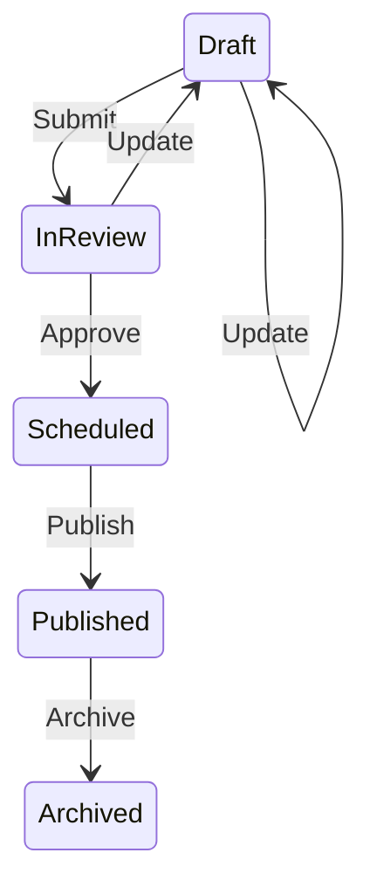

# State Machine

<p>
    <a href="https://github.com/rokde/state-machine/actions"></a>
    <a href="https://packagist.org/packages/rokde/state-machine"></a>
    <a href="https://packagist.org/packages/rokde/state-machine"></a>
    <a href="https://packagist.org/packages/rokde/state-machine"></a>
</p>

------
This package provides a generic implementation of the state machine pattern.

## Real world examples

### Article Lifecycle

Rules / Business process of an article lifecycle:
- A draft article can be submitted to get reviewed: Draft --Submit-> InReview
  - Guard: a draft article need to have all the required meta data
- The article in review can be approved so it will be scheduled for publication: InReview --Approve-> Scheduled
  - Guard: the published_at date has to be in the future or it gets published right away when it is null or in the past
- Scheduled articles gets published: Scheduled --Publish-> Published
  - Guard: published_at is now or in the past
- Updating draft articles or articles in review will get back into draft status : Draft/InReview --Update-> Draft
  - Guard: current acting user has to be the author of the article
- Already published articles can be archived: Published --Archive-> Archived
  - no guard

```php
// ArticleState should be an Enum/BackedEnum or string constants
enum ArticleState {
    case Draft;
    case InReview;
    case Scheduled;
    case Published;
    case Archived;
}
// ArticleEvent should be an Enum/BackedEnum or string constants
enum ArticleEvent {
    case Submit;
    case Approve;
    case Publish;
    case Update;
    case Archive;
}

$article = new Article();// this is your context

$articleRegistry = new \Rokde\StateMachine\TransitionRegistry();
$articleRegistry->addTransition(
    ArticleState::Draft, ArticleEvent::Submit, ArticleState::InReview,
    guard: fn($article) => $article->hasRequiredMeta(),
)->addTransition(
    ArticleState::InReview, ArticleEvent::Approve, ArticleState::Scheduled,
    guard: fn($article) => $article->published_at > now(),
)->addTransition(
    ArticleState::Scheduled, ArticleEvent::Publish, ArticleState::Published,
    guard: fn($article) => $article->published_at === null || $article->published_at <= now(),
)->addTransition(
    ArticleState::Draft, ArticleEvent::Update, ArticleState::Draft,
    guard: fn($article) => $article->author_id === currentUserId(),
)->addTransition(
    ArticleState::InReview, ArticleEvent::Update, ArticleState::Draft,
    guard: fn($article) => $article->author_id === currentUserId(),
)->addTransition(
    ArticleState::Published, ArticleEvent::Archive, ArticleState::Archived,
);

$sm = new \Rokde\StateMachine\StateMachine($articleRegistry);
$nextStatus = $sm->apply($article->status, ArticleEvent::Submit, $article);
$article->status = $nextStatus;
$article->save();
```

If you want a diagram representation of your process workflow, then just transform the registry to mermaid:

```php
$transformer = new Rokde\StateMachine\Transformers\RegistryMermaidTransformer();
$mermaidCode = $transformer->transform($articleRegistry);
```

This results in a diagramm like this:



The test can also be seen in [./tests/Feature/MermaidTest.php](MermaidTest.php).

### Order Lifecycle

This is built in the [./tests/Feature/TransitionTest.php](TransitionTest.php).

### Developer Happiness

🧹 Keep a modern codebase with **Pint**:
```bash
composer lint
```

✅ Run refactors using **Rector**
```bash
composer refactor
```

⚗️ Run static analysis using **PHPStan**:
```bash
composer test:types
```

✅ Run unit tests using **PEST**
```bash
composer test:unit
```

🚀 Run the entire test suite:
```bash
composer test
```
